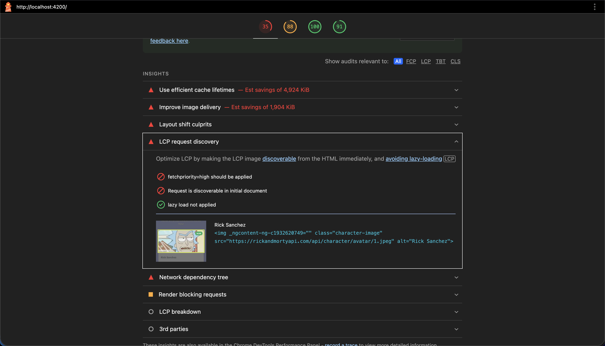
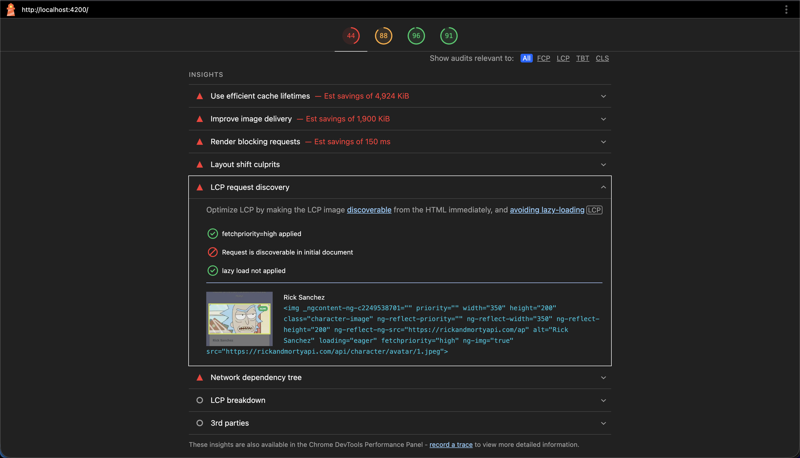
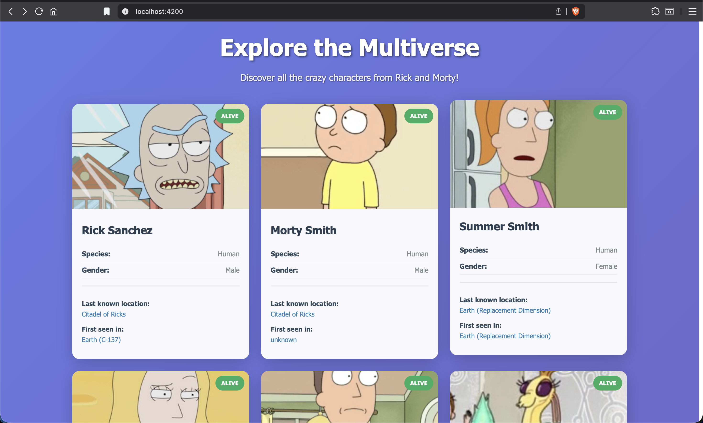
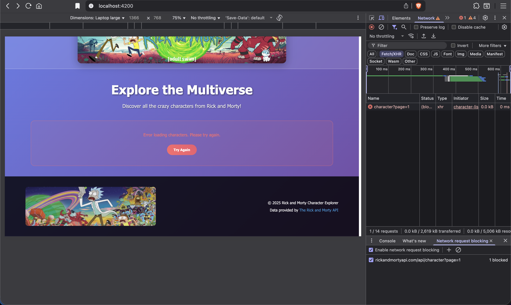
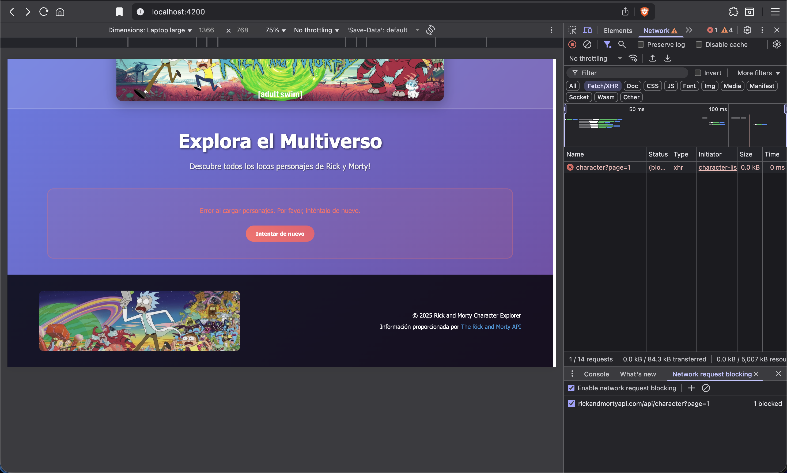

# Reto Técnico - Optimización y Accesibilidad en Angular

## Descripción

Este proyecto es una aplicación web desarrollada con Angular que consume la API pública de Rick and Morty para mostrar una lista de personajes. El objetivo principal de este reto es mejorar el rendimiento y la accesibilidad de la aplicación mediante diversas optimizaciones en esta aplicación.

El reto está descrito en detalle en el siguiente documento: [Reto Técnico para Workshop L3](./Reto%20Técnico%20para%20Workshop%20L3.pdf).

## Requisitos

- Node.js y npm instalados en la máquina.
- Angular CLI instalado globalmente.
- Se realiza checkout a la rama base `feature/unit-test`:
  ```bash
    git checkout feature/unit-test
  ```
- Instalar las dependencias del proyecto:
  ```bash
    npm ci
  ```

## Retos

### **1. Optimización de Imágenes con `ngSrc`**:

- Se realiza un análisis con Lighthouse para identificar problemas de rendimiento relacionados con las imágenes.
  - Se observa que hay una imagen crítica, la cabecera de cada personaje, la cual impacta negativamente en el LCP (Largest Contentful Paint). Se puede ver el reporte detallado aquí: [LCP report](./docs/lighthouse-reports/1-lighthouse-previous.pdf)
    
- Se importa la directiva `NgOptimizedImage` en el archivo `app.module.ts` para habilitar la optimización de imágenes en Angular.
- Se reemplaza en las etiquetas `` el atributo `src` por la directiva `ngSrc` de Angular para mejorar la carga y el rendimiento de las imágenes.
- Se especifican los atributos `width` y `height` para todas las imágenes con valores adecuados, y además se agrega el atributo `priority` para optimizar la carga de la imagen crítica reportada con alto LCP por Lighthouse.
- Se vuelve a ejecutar el análisis con Lighthouse para verificar las mejoras en el rendimiento. Se observa una mejora significativa en el rendimiento, pasando del 35% al 44%. Se puede ver el reporte detallado aquí: [LCP improved report](./docs/lighthouse-reports/1-lighthouse-previous)
  

### **2. Implementación de internacionalización con i18n (@angular/localize)**:

- Se instala el paquete `@angular/localize` para habilitar la internacionalización en la aplicación:
  ```bash
    ng add @angular/localize
  ```
  Esto realiza la configuración inicial necesaria para utilizar las funcionalidades de internacionalización en Angular.
- Para este reto, como el proyecto ya tiene un idioma base (inglés), se selecciona como idioma adicional el español de Colombia (es-CO).
- Se identifican los textos estáticos en los archivos de componentes y se envuelven con la directiva `i18n` para marcarlos para traducción.
  - Además, se agrega el operador `$localize` en los archivos TypeScript para los textos estáticos que necesitan ser traducidos (por ejemplo, el mensaje de error al consultar la API).
- Se realiza la extracción de los mensajes marcados para traducción utilizando el comando:
  ```bash
    ng extract-i18n --output-path src/locale --format json
  ```
  Esto genera un archivo `messages.json` en la carpeta `src/locale` que contiene todos los textos marcados para traducción.
  **Nota**: Se escoge el formato `json` para facilitar la edición de las traducciones.
- Se crea una copia del archivo `messages.json` y se renombra a `messages.es-CO.json` para el idioma español de Colombia.
- Se editan las traducciones en el archivo `messages.es-CO.json` para proporcionar las traducciones adecuadas.
- Se configura el archivo `angular.json` para incluir la configuración de localización, especificando el idioma base y los archivos de traducción:
  - Se agrega la configuración en la sección `i18n` del archivo `angular.json`:
    ```json
    "i18n": {
      "sourceLocale": {
        "code": "en-US",
        "baseHref": "/"
      },
      "locales": {
        "es-CO": {
          "translation": "src/locale/messages.es-CO.json",
          "baseHref": "/es/"
        }
      }
    }
    ```
    **Nota**: Se agrega el atributo `baseHref` para cada idioma para manejar correctamente las rutas al servir la aplicación en diferentes idiomas.
  - Se agrega una nueva configuración de build basada en `development` para el idioma español de Colombia en la sección `architect > build > configurations`:
    ```json
    "es-CO": {
      "buildOptimizer": false,
      "optimization": false,
      "vendorChunk": true,
      "extractLicenses": false,
      "sourceMap": true,
      "namedChunks": true,
      "localize": ["es-CO"]
    }
    ```
  - Se agrega una nueva configuración de serve basada en `development` para el idioma español de Colombia en la sección `architect > serve > configurations`:
    ```json
    "es-CO": {
      "browserTarget": "angular-sofkau:build:es-CO"
    }
    ```
  - Se agrega el localize de las otras configuraciones de build con el locale del idioma base `en-US` en la sección `architect > build > configurations`:
    ```json
    "localize": ["en-US"]
    ```
  - Y por último, se agrega la opción de localize `true` en las opciones generales de build en la sección `architect > build > options`:
    ```json
    "localize": true
    ```
- Se ejecuta el build de la aplicación para que se generen los archivos necesarios para cada idioma:
  ```bash
    npm run build
  ```
  Esto genera una carpeta `dist/angular-sofkau/browser` que contiene en carpetas los archivos de la aplicación para cada uno de los locales especificados.
  ```text
  dist/angular-sofkau/
  └── browser/
      ├── en-US/
      │   ├── assets/
      │   ├── index.html
      │   └── ...
      └── es-CO/
          ├── assets/
          ├── index.html
          └── ...
  ```
  Con esto, la aplicación está lista para ser servida en ambos idiomas en un servidor, como Nginx o Apache. Cabe resaltar que el servidor debe estar configurado para servir la carpeta correcta según el idioma preferido del usuario (por ejemplo, utilizando la cabecera `Accept-Language`).
- Se puede servir la aplicación en el idioma base (inglés) utilizando el comando:
  ```bash
    npm start
  ```
  La aplicación estará disponible en `http://localhost:4200/`.
  
  
- Se puede servir la aplicación en el idioma español de Colombia utilizando el comando:
  ```bash
    npm run start:es
  ```
  La aplicación estará disponible en `http://localhost:4200/`.
  
  

### **3. Pruebas**:

#### Adecuaciones

Debido a la incorporación de la optimización de imágenes y la internacionalización en la aplicación, fue necesario realizar algunos ajustes en las pruebas unitarias para garantizar su correcto funcionamiento.

- Se añadió la importación de la directiva `NgOptimizedImage` en los archivos de pruebas unitarias donde se utilizan imágenes optimizadas, dentro de la sección de imports de `TestBed.configureTestingModule`.
- Se actualizó el archivo `setup-jest.ts` para incluir la configuración necesaria que permite manejar la internacionalización en las pruebas unitarias. Se agregó el siguiente código:
  ```typescript
  import "@angular/localize/init";
  ```
  Esto asegura que las funciones de localización estén disponibles durante la ejecución de las pruebas.

#### Nuevas pruebas

Dado que el proyecto parte de una cobertura del 100% en las pruebas unitarias y que Jest solo valida la parte lógica de los componentes (es decir, sus archivos TypeScript), se adopta un enfoque diferente para realizar pruebas de integración entre la lógica del componente y su template visual. El objetivo es verificar que la información cargada en el componente se visualice correctamente en el DOM, en los lugares esperados y con los valores correctos.

Por lo tanto, se han creado nuevas pruebas unitarias para asegurar que la renderización de cada personaje se realice correctamente en la plantilla del componente. Esto se logra implementando consultas a los DebugElements que ofrece TestBed durante el ciclo de vida del componente. Se realizan consultas CSS a los DebugElements para buscar elementos en el DOM que posean ciertas clases definidas para cada dato visual, y posteriormente se hacen aserciones para comprobar que dichos elementos del DOM contienen los valores correspondientes al personaje cargado en la variable del componente.

Las pruebas implementadas son las siguientes:

1. **should render all character cards elements**: Verifica que se rendericen todas las tarjetas de personajes según la respuesta de la API.
2. **should render character images with correct data**: Verifica que se renderice correctamente la visualización de cada personaje presente en el array `component.characters`, compuesto por un elemento de imagen del personaje y un elemento tipo span con el estado del personaje (vivo, muerto, desconocido).
3. **should render character info with correct data**: Verifica que se renderice correctamente la información de cada personaje en el array `component.characters`, que incluye un título de nivel 3 con el nombre del personaje, un contenedor con varios elementos tipo span para la especie, tipo (no siempre presente) y género, y otro contenedor con elementos tipo span para la última ubicación conocida y el origen del personaje.

Estas pruebas se encuentran en el archivo `character-list.component.spec.ts`, en las líneas 255, 265 y 294 respectivamente.
